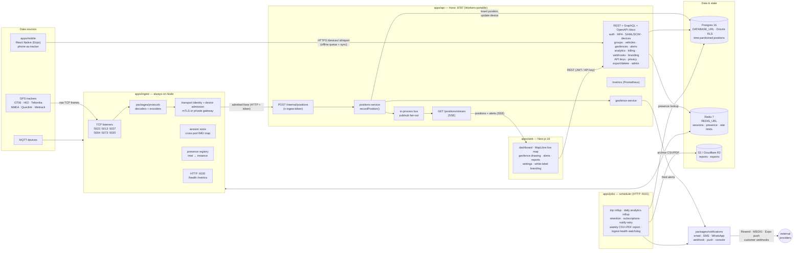
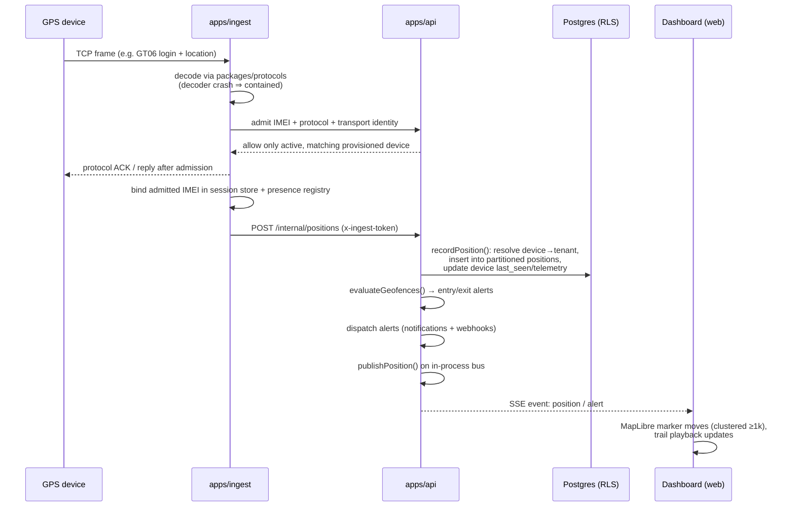
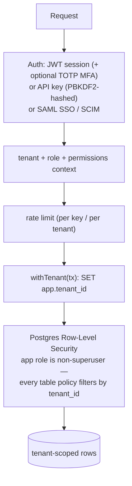
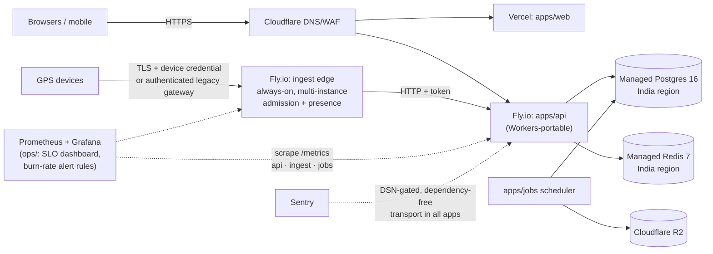

# TrackFlow Architecture

TrackFlow is a hybrid-serverless, multi-tenant GPS-tracking SaaS built as a pnpm + turbo monorepo.
The only always-on piece is the TCP **ingest** service (GPS devices hold sockets open); everything
else scales to ~zero. This document is the visual companion to [README.md](../README.md),
[DEPLOY.md](../DEPLOY.md), and [PROJECT_PLAN.md](PROJECT_PLAN.md).

## System overview

**Shared packages** underpin all apps: `packages/protocols` (decoder framework + 6 protocols +
two-way command encoders), `packages/core` (pure geofence + trip-detection engines),
`packages/db` (Drizzle schema, migrations, RLS), `packages/shared` (JWT, PBKDF2, TOTP/MFA,
zod schemas, plans/quotas, presence store, dependency-free Sentry transport — all edge-portable),
`packages/notifications` (channel adapters), and `packages/storage` (S3/R2 client).

## Position data flow (hot path)

Failures never propagate backwards: a flaky sink doesn't drop the device socket, a decoder
crash on a malformed frame drops that buffer only, and telemetry (Sentry, metrics) never
blocks the pipeline.

## Multi-tenancy & security

- Migrations run as the DB **owner** (`ADMIN_DATABASE_URL`). Tenant queries use
  the `NOSUPERUSER NOBYPASSRLS` identity (`DATABASE_URL`); enumerated
  cross-tenant paths use a separate `SYSTEM_DATABASE_URL` identity and are
  reviewed in `docs/SYSTEM_ACCESS_INVENTORY.md`.
- Audit log, quotas and plan limits are enforced per tenant; privacy routes provide
  DPDP/GDPR export and workspace hard-delete.

## Deployment topology (low-cost stack)

Local development replaces all of this with `docker compose` (Postgres 16 + Redis 7) and
`pnpm api:dev / ingest:dev / web:dev`; a built-in simulator (`pnpm --filter @trackflow/ingest sim`)
feeds the map without hardware.

The production security profile and cost-conscious regional choice are defined
in [production-edge-and-topology.md](case-study/production-edge-and-topology.md).
IMEI-only internet exposure is not the target production identity model.
