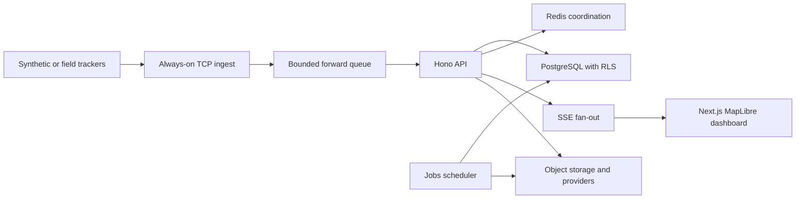
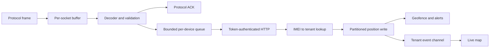
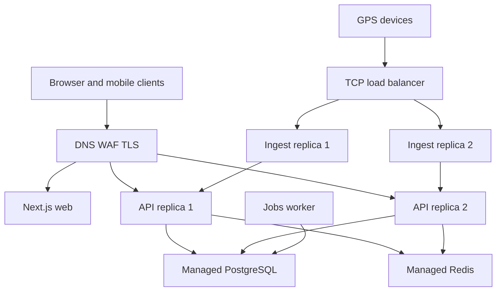
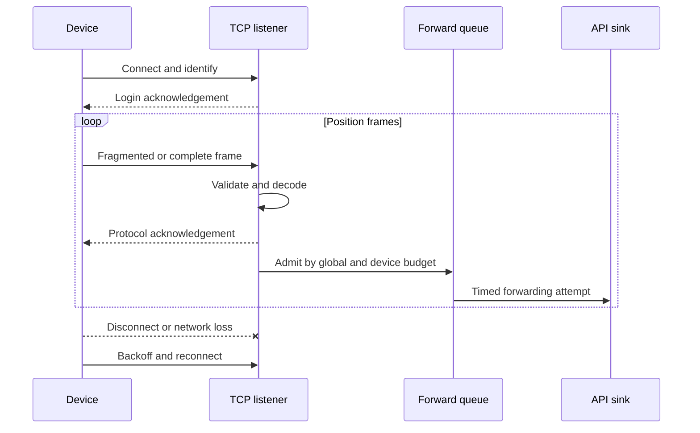
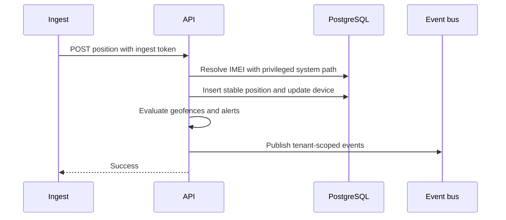
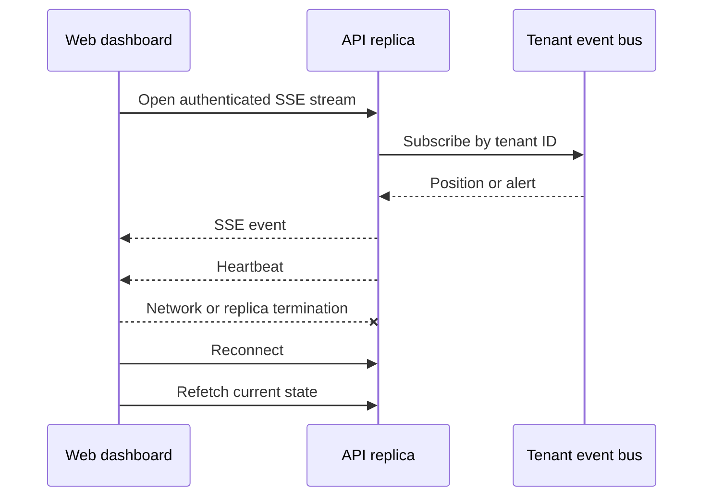
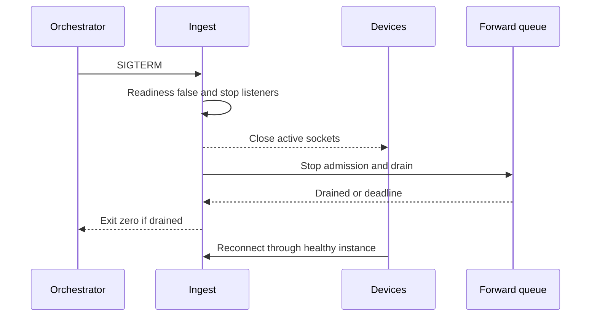
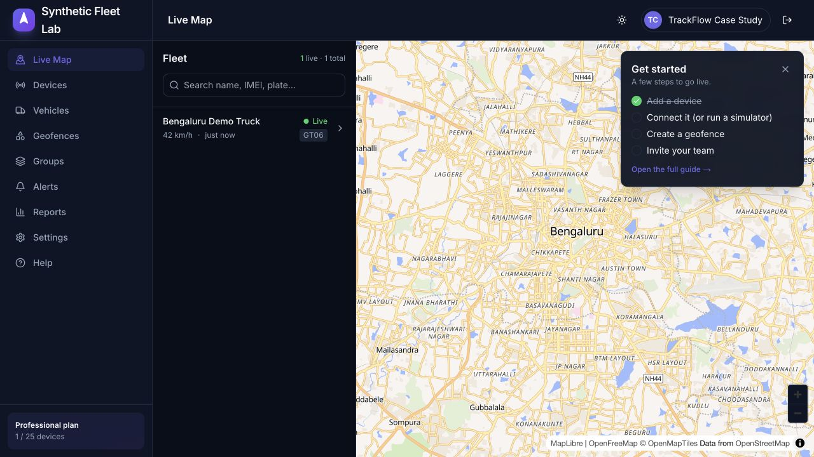
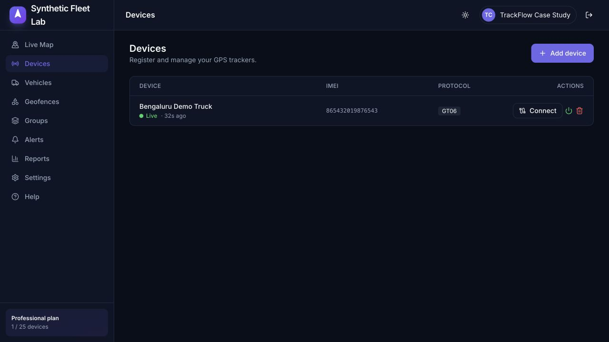

# Designing and Validating a Multi-Tenant GPS Platform

## From raw TCP packets to real-time maps

TrackFlow is a TypeScript GPS platform whose difficult boundary is not the map:
it is accepting long-lived, weakly authenticated legacy device sessions without
letting malformed traffic, a slow dependency, or one tenant exhaust the
platform. This case study documents what the repository implements, what was
directly exercised, and what remains a design target.

## Requirements and constraints

- Preserve GT06, H02, Teltonika Codec 8, NMEA, Queclink, Meitrack and MQTT
  support.
- Keep long-lived TCP ingest separate from stateless HTTP/UI workloads.
- Enforce tenant isolation in PostgreSQL, including default deny when tenant
  context is missing.
- Fail predictably under sink slowdown with finite memory.
- Use synthetic data only and retain raw, machine-readable evidence.
- Keep the stack viable for a small operator without equating low cost with
  proven high availability.

The detailed [workload model](workload-model.md) defines five tiers. Only the
local 1,000-connection TCP boundary has direct capacity measurements. The
[production edge/topology decision](production-edge-and-topology.md) defines
the device credential ladder and cost-conscious first production shape.

## Architecture

The API and jobs can be replicated as stateless compute only after their
connection pools and fan-out coordination are measured. Ingest replicas hold
socket-local decoder state and therefore recover through device reconnect, not
live session migration.

## Hot-path data flow

## Deployment topology

This is the intended topology, not a multi-instance measurement. The local
benchmark used one ingest process, a deterministic mock HTTP sink, and no
database or Redis.

## Connection and delivery sequences

### Device connection lifecycle

### Position ingestion

### SSE delivery and reconnect

### Graceful ingest deployment

## Decisions and rejected alternatives

The [ADR index](../adr/README.md) records thirteen decisions with alternatives,
consequences, risks, and explicit revisit triggers. The central trade-offs are:

- a hybrid topology instead of a monolith or all-serverless runtime;
- RLS default-deny instead of application-only tenant predicates;
- SSE instead of WebSockets for one-way browser updates;
- bounded in-memory forwarding instead of unlimited buffering;
- PostgreSQL as source of truth, with Redis kept ephemeral;
- explicit at-least-once/best-effort paths instead of an exactly-once claim.

## Backpressure and recovery change

The original ingest path launched an unbounded promise for every decoded
message. A slow API could therefore accumulate work until the process exhausted
memory. The new queue has:

- 10,000 total and 32 per-device default admitted messages;
- 64 concurrent sink requests;
- a 5-second attempt timeout and three-attempt cap;
- exponential backoff with jitter for 408, 429, 5xx, timeout and network errors;
- categorized failure/drop metrics;
- readiness failure and graceful drain.

Unit tests prove bounded admission, noisy-device containment, retry
classification, drain success/timeout, and rejection after shutdown.

## Load-test environment and results

Direct runs were executed on macOS arm64, Apple M4 (10 logical CPUs), 24 GiB
memory, Node v24.13.0. The identical seeded workload used 1,000 persistent
sockets split equally among GT06, H02, Teltonika and NMEA, one report/second,
malformed and fragmented frames, duplicates, out-of-order timestamps, jitter,
churn, and graceful/ungraceful disconnects.

| Metric | Before parser hardening | After parser hardening |
|---|---:|---:|
| Peak active connections | 1,000 | 1,000 |
| Packets sent | 17,556 | 17,566 |
| Generator throughput | 990.91 packets/s | 991.20 packets/s |
| Connection p95 | 0.34 ms | 0.39 ms |
| Protocol ACK p95 | 37.61 ms | 33.57 ms |
| Event-loop lag p95 | 1.75 ms | 1.86 ms |
| Generator maximum RSS | 103.1 MiB | 82.8 MiB |
| Ingest decoder exceptions | 1 | 0 |
| Sink queue drops | 0 | 0 |

The throughput/latency differences are not statistically significant. The
verified improvement is the Teltonika decoder exception moving from one to zero
without introducing queue loss. Charts and caveats are generated from the raw
JSON in [the benchmark report](tcp-1000-report.md).

## Browser-verified synthetic workflow

The production Next.js build was served locally through its optional
same-origin API proxy. A synthetic workspace and GT06 device were created
through the UI, a synthetic Bengaluru position was submitted through the
token-gated ingest endpoint, and the browser verified a connected SSE request,
one live device, 42 km/h telemetry, and the mapped fleet view.

## Bottleneck discovered

Malformed but CRC-valid Teltonika input could pass the outer frame checks and
raise a `RangeError` while parsing a truncated record. The server contained the
exception, but it was still wasted work and a denial-of-service signal. The
decoder now caps body length, accepts only Codec 8/8E, limits record count,
validates the trailing count, and treats truncated records as invalid data.

## Tenant isolation and data lifecycle

Twenty-three tenant-scoped tables use `FORCE ROW LEVEL SECURITY` with both
`USING` and `WITH CHECK` policies. Application requests set transaction-local
tenant context using a non-superuser role; narrowly reviewed ingest/jobs paths
use an explicit system bypass. Existing tests prove default deny, symmetric read
isolation, and cross-tenant write rejection. The broader route/job/GraphQL/SSE
matrix remains a release gap.

Positions are time partitioned with future-partition and guarded retention
functions. The executed restore drill confirmed 27 migrations, partitioned
position storage and forced RLS on 23 tables. Query plans, noisy-neighbour
behaviour, and large-volume retention are not yet measured.

## Security model

The dependency tree is locally free of known advisories and the full-history
test-vector exception is narrowly scoped. API input uses Zod validation;
production rejects default secrets; authenticated routes use permission and
rate-limit middleware; webhooks are HMAC-signed and protected against private
network targets. The [security report](../../security_best_practices_report.md)
and [threat model](../../trackflow-open-source-threat-model.md) describe
residual risk. The [public workflow status](public-security-status.md)
distinguishes the red scheduled `main` result from the remediated local branch.

The fundamental limitation remains: IMEI is not cryptographic device identity.
TLS, network admission control, replay detection, and per-device/gateway
credentials are required for higher-assurance fleets.

## Backup and recovery evidence

The local logical restore used synthetic data and a PostgreSQL custom-format
backup:

| Result | Direct measurement |
|---|---:|
| Backup size | 126,566 bytes |
| Backup duration | 193.98 ms |
| Restore duration | 541.22 ms |
| Synthetic marker | 1 row recovered |
| Local snapshot RPO | 0 |

Redis state, object-storage artifacts, provider records, DNS, and deployment
configuration were intentionally excluded. This proves local logical
recoverability, not managed PITR or regional disaster recovery.

## Cost and capacity boundaries

The generated [cost model](cost-model.md) uses public list prices and explicit
traffic/storage assumptions. It estimates:

| Devices | Lean/month | HA/month | Evidence class |
|---:|---:|---:|---|
| 1,000 | $92.67 | $292.67 | Estimate |
| 10,000 | $533.26 | $733.26 | Estimate |
| 50,000 | $2,223.01 | $2,423.01 | Estimate |

These are not bills. The 10,000-device tier requires measured Redis fan-out,
database/query gates, and connection-aware ingest placement. The 50,000-device
tier requires sharded connection ownership, durable event handoff, reporting
read replicas, and archival tiering.

## Remaining risks and limitations

- The dependency and test-vector remediations were merged in PR #7, the
  standalone mobile advisory was resolved in PR #9, and merged-main Security
  run `30430688995` is green. This closes the public workflow evidence gap.
- Authenticated API, PostgreSQL RLS/query-plan, and two-replica local Redis/SSE
  results are versioned with raw samples and CI budgets. They are bounded
  synthetic development evidence; domain workflow and production-shaped
  hosted capacity results remain absent.
- Multiple API/ingest replicas and three infrastructure failure recoveries have
  not been exercised.
- The RLS suite now checks the tenant/system identity split and inventories
  privileged paths; hosted credential provisioning is still unverified.
- Redis-backed SSE fan-out and holder-targeted command wake-up are locally
  verified through real Redis. The quantitative local SSE run delivered
  27,620/27,620 healthy events with zero loss or duplicates, but it is not
  hosted proxy, browser-network, failover, or production multi-replica evidence.
- The 10,000-device manual gate remains unverified.
- The local restore is not provider PITR or regional recovery.
- A recorded demo remains pending; the browser-verified screenshots and
  deterministic [demo script](demo-script.md) are ready.

The current P0/P1/P2 work is tracked in
[Production readiness](../PRODUCTION_READINESS.md).
