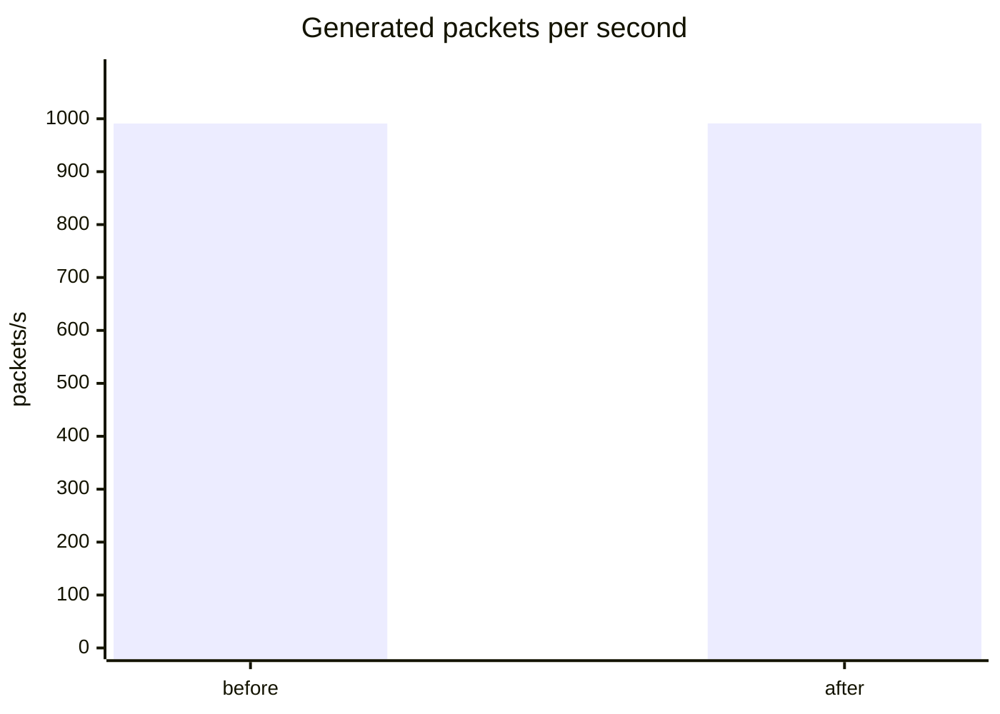
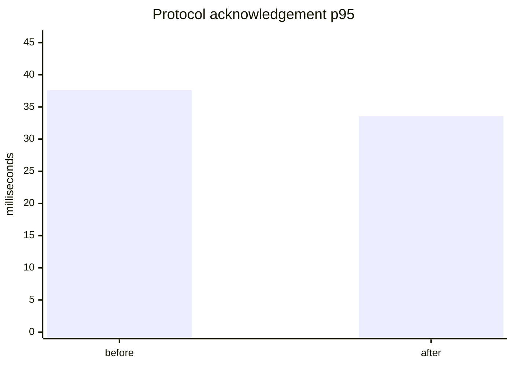

# TCP ingestion benchmark: 1,000 synthetic devices

Generated from the versioned raw artifacts below. Values are direct local
measurements, not production capacity claims.

- Before: `tcp-1000-before-parser-hardening.json`
- After: `tcp-1000-after-parser-hardening.json`
- Workload: 1000 devices; gt06=250, h02=250, teltonika=250, nmea=250; 1000 ms reporting; seed 42
- Environment: Apple M4; 10 logical CPUs; arm64; v24.13.0

| Metric | Before | After |
|---|---:|---:|
| Peak active connections | 1000 | 1000 |
| Packets sent | 17556 | 17566 |
| Generator packets/s | 990.91 | 991.20 |
| Connection p95 (ms) | 0.34 | 0.39 |
| Protocol ACK p95 (ms) | 37.61 | 33.57 |
| Event-loop lag p95 (ms) | 1.75 | 1.86 |
| Generator max RSS (MiB) | 103.1 | 82.8 |
| Ingest decode exceptions | 1 | 0 |
| Sink queue drops | 0 | 0 |

## Charts

## Finding and change

The before run produced 1 contained
Teltonika parser exception under malformed/fragmented traffic. The decoder now
bounds the advertised data length, validates codec/count/count2 structure, and
drops truncated records without throwing. The identical after run produced
0 parser exceptions.

Throughput changed 0.0%
and ACK p95 changed -10.8%. These small local differences are not statistically significant; the
verified improvement is removal of the parser exception without queue loss.

## Boundary and limitations

- The measured boundary is simulator → TCP ingest → deterministic local HTTP sink.
- Protocol ACK latency is not Postgres commit latency or ingest-to-map latency.
- The generator opened all 1000 requested sockets.
- No sink queue drops were observed; this run does not establish the queue's
  failure capacity under a slow database.
- The 10,000/50,000/100,000 tiers remain unverified design targets.
