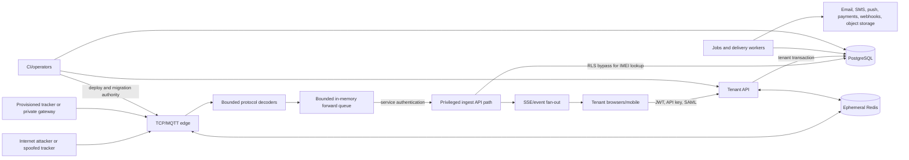

# TrackFlow threat model

## 1. Executive summary

TrackFlow accepts attacker-controlled raw GPS protocol traffic, turns it into
precise location records, and exposes those records through a multi-tenant web,
mobile, API, reporting, alerting, and webhook product. The most important risks
are forged telemetry from IMEI-only legacy devices, parser or connection
denial-of-service at the public TCP edge, compromise of privileged
ingest/system paths, and cross-tenant disclosure of location history.

Development currently uses synthetic data only. Before real tenants or
locations are admitted, TrackFlow should require cryptographic per-device
identity where hardware supports it and a private authenticated gateway for
legacy hardware where possible. Internet-facing IMEI-only access must be a
time-bounded exception with explicit admission controls and acknowledged
spoofing risk.

The current code has meaningful controls: bounded parsing and forwarding,
checksums, graceful draining, production secret checks, forced PostgreSQL RLS,
role and permission middleware, rate limiting, webhook target validation,
dependency scanning, secret scanning, and restore verification. It does not
yet prove production-safe device identity, durable ingest delivery,
multi-replica real-time fan-out, complete RLS path coverage, or infrastructure
failover.

## 2. Scope and assumptions

In scope:

- `apps/ingest`, its raw TCP/MQTT listeners, protocol decoders, presence/session
  state, metrics surface, and API forwarder;
- `apps/api`, including auth, tenant APIs, privileged internal/admin paths,
  SSE, GraphQL, billing, privacy, notifications, and tenant webhooks;
- `apps/jobs`, reports, retention, retries, health checks, and object storage;
- the Next.js web app and Expo mobile app;
- PostgreSQL/Neon, Redis/Upstash, report/export object storage, and external
  email, SMS, WhatsApp, push, payment, SSO, and webhook providers;
- CI/CD, deployment configuration, operator secrets, backups, and monitoring.

Assumptions:

- only synthetic tenants and positions are used until the production gates are
  complete;
- the first production data plane uses Fly, Neon, Upstash, and Vercel in a
  common Singapore region where applicable;
- tracker ports may be reachable from the internet, but the target design puts
  a narrow gateway in front of core services;
- legacy protocols may provide only IMEI and checksums, not cryptographic
  authentication or confidentiality;
- PostgreSQL is the durable system of record; Redis state is reconstructable
  and may be lost;
- API and jobs connect as a non-superuser application role, while migrations
  use a separately protected owner role;
- the local repository and test evidence are trusted inputs, but public CI on
  the unpublished branch is not yet evidence.

Out of scope:

- physical tampering with trackers beyond theft or extraction of a provisioned
  device credential;
- cellular carrier infrastructure internals;
- provider control-plane internals not configurable by TrackFlow;
- correctness of third-party map tiles and GPS satellite signals;
- security guarantees for hardware that cannot support credentials or secure
  transport.

## 3. System model

### Primary components

| Component | Security role |
|---|---|
| GPS/MQTT/phone trackers | Untrusted telemetry producers; future holders of per-device identity |
| TCP/MQTT ingest edge | Public parser and connection boundary; no direct database access |
| Protocol package | Decodes hostile binary/text frames and produces acknowledgements |
| Ingest forward queue | Bounds memory, concurrency, retries, and shutdown drain |
| Hono API | Authenticates users/services, applies authorization, handles privileged system paths |
| Next.js/Expo clients | Display precise locations and store/use session credentials |
| PostgreSQL | Durable tenant, identity, billing, command, alert, and location system of record |
| Redis | Ephemeral rate-limit, presence, route, and future fan-out coordination |
| Jobs and notifications | Privileged background processing and outbound delivery |
| Object storage | Reports, invoices, exports, and logical backup artifacts |
| CI/CD and provider control planes | Build provenance, deployment, secrets, DNS, and recovery control |

### Data flows and trust boundaries

1. A tracker crosses the public-network boundary and sends raw TCP/MQTT frames
   to ingest. IMEI may identify but does not authenticate it.
2. Ingest parses bounded frames, replies at the protocol layer, updates
   ephemeral presence/session state, and sends normalized events to an
   internal API endpoint using a shared service secret.
3. The API uses a privileged RLS-bypass transaction to resolve IMEI to tenant,
   then writes the position and derived state to PostgreSQL.
4. Browsers/mobile cross the internet boundary using JWT/API-key/SAML
   authentication and receive tenant-scoped data through REST, GraphQL, and
   SSE.
5. Jobs and API processes cross outbound-provider boundaries to notifications,
   payment providers, customer webhooks, object storage, and identity
   providers.
6. Operators and CI cross a high-privilege control-plane boundary containing
   migration credentials, signing keys, service tokens, provider keys, DNS,
   and deploy authority.

### Diagram

## 4. Assets/security objectives

| Asset | Objective |
|---|---|
| Precise current and historical locations | Confidentiality by tenant and user permission; integrity and source provenance; purpose-limited retention |
| Tenant/device/vehicle identity mapping | Prevent cross-tenant association, enumeration, and unauthorized reassignment |
| Device commands | Authenticate issuer and target; prevent replay, alteration, or cross-device delivery |
| User sessions, MFA recovery codes, API keys | Confidentiality, bounded lifetime, rotation/revocation, replay detection |
| Ingest/admin/DB/provider secrets | Least privilege, non-disclosure, rotation, and auditable use |
| Billing, alerts, reports, audit events | Integrity, idempotency, traceability, and recoverability |
| Service availability | Bound hostile connections/work, shed load predictably, recover without silent corruption |
| Tenant isolation | Default deny at PostgreSQL and consistent enforcement across REST, GraphQL, SSE, jobs, reports, and system paths |
| Backups and exports | Same confidentiality and retention controls as primary location data; tested restoration |

## 5. Attacker model

### Capabilities

- connect repeatedly to every public tracker port and send arbitrary,
  fragmented, oversized, slow, malformed, duplicated, or replayed frames;
- learn or guess a victim IMEI and forge syntactically valid GPS data;
- observe or modify plaintext tracker traffic on an untrusted network;
- create a tenant account, obtain normal authenticated access, and manipulate
  identifiers, GraphQL inputs, exports, webhooks, SSO/SCIM, and billing flows;
- steal browser tokens through XSS, browser extensions, screenshots, URL/log
  leakage, or a compromised endpoint;
- control a webhook destination and DNS records, including changing resolution
  between validation and delivery;
- exploit a vulnerable dependency, build action, provider credential, or
  over-privileged operator account;
- cause provider, network, Redis, process, or database faults and exploit retry
  or fail-open behavior.

### Non-capabilities

- break correctly implemented modern cryptography or guess high-entropy
  credentials within their lifetime;
- bypass provider isolation without a provider vulnerability;
- read PostgreSQL rows that forced RLS correctly denies unless a privileged
  system/owner path is compromised or misused;
- make legacy IMEI-only telemetry cryptographically trustworthy without a
  device/gateway change.

## 6. Entry points/attack surfaces

- six raw TCP protocol ports and optional MQTT subscription;
- ingest health/metrics surface and Redis REST credentials;
- internal ingest position and command endpoints;
- public REST, GraphQL, OpenAPI/docs, auth/reset/MFA, SAML, SCIM, API-key,
  admin, billing, privacy, report, push, and webhook routes;
- SSE access token in the query string and browser `localStorage` token;
- customer-controlled webhook URLs and provider callbacks;
- uploaded/imported/exported data and generated CSV/PDF artifacts;
- PostgreSQL application, owner, and RLS-bypass paths;
- Redis, object storage, email/SMS/WhatsApp/push/payment/SSO provider APIs;
- GitHub Actions, dependency graph, container images, branch rules, deployment
  credentials, DNS, and cloud dashboards;
- logs, traces, metrics labels, crash reports, backups, and operator tooling.

## 7. Top abuse paths

1. **Forge a known IMEI and poison location history.** Connect to the matching
   protocol port, submit a valid frame with a victim IMEI, and cause false
   positions, geofence alerts, reports, or operational decisions.
2. **Exhaust the ingest edge.** Hold many sockets, send slow fragments or parser
   edge cases, and consume descriptors, memory, CPU, queue capacity, or API
   work until legitimate devices are delayed or dropped.
3. **Steal the shared ingest token.** Use it to call a privileged cross-tenant
   system path directly and submit positions or claim/ack commands across the
   fleet.
4. **Exploit an RLS-bypass path.** Manipulate IMEI/device identifiers or a bug
   in API/jobs/system code to read or write another tenant's data outside a
   normal `withTenant` transaction.
5. **Steal a browser/SSE token.** Recover it from `localStorage`, a query URL,
   logs, analytics, or an XSS foothold and subscribe to live tenant locations.
6. **Reach an internal service through webhooks.** Use DNS rebinding, redirect
   behavior, alternate address forms, or a race after validation to access
   private metadata/control surfaces.
7. **Amplify retries and duplicates.** Trigger timeout-after-commit, Redis
   outages, reconnect churn, or provider errors so positions, alerts, commands,
   invoices, or notifications are duplicated or lost.
8. **Compromise CI or cloud control planes.** Alter dependencies/workflows,
   steal deployment or database-owner credentials, then deploy code or extract
   all tenants' data while appearing operationally legitimate.

## 8. Threat model table

| ID | Threat and path | Impact | Likelihood | Existing controls | Required/recommended mitigation | Residual risk |
|---|---|---|---|---|---|---|
| TM-001 | IMEI spoofing and GPS poisoning through raw TCP | High: corrupt tracks, alerts, reports, commands, and trust | High for internet-facing legacy ports | Checksums, structured parsers, unknown IMEI skipped by API | mTLS or unique device secret; otherwise private APN/authenticated gateway; reject unknown IMEI at edge; replay and plausibility detection | High for any approved IMEI-only exception |
| TM-002 | Connection/parser/queue denial-of-service | High: fleet telemetry delay/loss | Medium-high | 64 KiB buffer, decoder containment, bounded queue/per-key cap, timeouts/retries, metrics, graceful drain | Edge per-IP/network/IMEI limits; connection timeouts; Fly connection limits tuned by load test; fuzzing; file-descriptor and backlog alerts | Medium; distributed attacks can still exhaust paid capacity |
| TM-003 | Shared ingest token disclosure or replay | Critical: privileged cross-tenant writes and command access | Medium | Production default-secret refusal, secret storage, narrow endpoints | mTLS/workload identity, network restriction, short-lived scoped credentials, safe comparison, rotation, audit every system call | Medium until shared bearer is removed |
| TM-004 | Incorrect use of `withSystem` or DB owner | Critical: full cross-tenant read/write | Medium | Forced RLS, non-superuser role, explicit bypass helper, DB tests | Enumerate/review every bypass; separate service roles; deny owner at runtime; expand REST/GraphQL/SSE/jobs tests; alert on bypass use | Medium pending complete path coverage |
| TM-005 | Access token theft from `localStorage` or SSE query | High: live and historical location disclosure | Medium | Short-lived access JWT, refresh rotation/replay detection, MFA | Prefer secure HttpOnly same-site cookies/BFF; avoid query tokens or use single-use short-lived SSE tickets; CSP and XSS review; redact URLs | Medium until browser token transport changes |
| TM-006 | Tenant webhook SSRF including DNS rebinding/redirect | High: internal metadata/service access | Medium | Scheme/credential checks, private-address rejection, DNS revalidation, HTTPS in production, HMAC delivery | Pin resolved public IP for the request, disable redirects, egress proxy/allow policy, revalidate every hop, block link-local/provider metadata | Low-medium |
| TM-007 | Duplicate, replayed, late, or fabricated events | Medium-high: false state and duplicate external side effects | High under normal network faults | Stable position identity, delivery logs, retry bounds, refresh-token replay protection | Per-device sequence/time replay windows, idempotency keys across all side effects, timeout-after-commit tests, explicit late-data policy | Medium |
| TM-008 | Redis outage or inconsistent multi-replica state | Medium: rate-limit degradation, stale presence, missing live events | Medium | PostgreSQL remains source of truth; TTL state; in-memory fallback | Define fail-open/closed per feature; shared fan-out; rebuild presence; chaos tests; Prod Pack only when SLO/economics justify | Medium, acceptable only because Redis is non-durable |
| TM-009 | In-memory ingest queue lost on process/region failure | High: positions acknowledged by device but never durable | Medium | Bounded queue, retry/backoff, graceful drain | Define RPO; durable queue/WAL before strict production RPO; protocol ACK only at defensible delivery stage where supported; failure drills | High until durable handoff exists |
| TM-010 | Command theft, reassignment, or replay | High: remote action on wrong vehicle/device | Medium | Token-gated internal routes, tenant-scoped command creation, status lifecycle | Cryptographic device identity, command nonce/expiry/signature, atomic target binding, audit and high-risk confirmation | Medium-high for legacy devices |
| TM-011 | CI/dependency/container compromise | Critical: code execution and all production secrets | Low-medium | Pinned action SHAs, audit, Semgrep, Gitleaks, SBOM, Dependabot | Protected review, least-privilege OIDC deploys, artifact provenance/signing, image scanning, environment approvals, secret rotation drills | Low-medium |
| TM-012 | Backup/export/report disclosure | High: bulk historical location exposure | Medium | RLS, storage abstraction, privacy routes, restore verifier | Per-tenant authorization, private buckets, encryption/key separation, signed URL limits, export audit, retention/deletion propagation | Medium until provider configuration is verified |
| TM-013 | Notification/payment/SSO callback forgery | High: account, billing, or alert manipulation | Medium | Provider-specific authentication/HMAC code, API scopes, delivery logs | Raw-body signature verification, timestamp/replay windows, server-side reconciliation, key rotation, negative integration tests | Medium pending live-provider acceptance |
| TM-014 | Sensitive telemetry in logs/metrics/traces | High: indirect location/credential disclosure | Medium | Traffic logging configurable, metrics token, error categorization | Disable traffic logs in production, structured redaction, never label by IMEI/tenant, retention/access controls, sample audit | Low-medium |

## 9. Criticality calibration

**Critical** means a plausible path can disclose or alter all tenants, gain
deployment/database-owner authority, or issue fleet-wide commands. Examples:
compromised ingest/system credentials, misuse of the database owner, or CI
control-plane compromise.

**High** means one or more tenants can lose location confidentiality/integrity,
devices can receive unauthorized commands, or the ingest service can lose a
material period of telemetry. Examples: IMEI spoofing, browser token theft,
durable-queue absence, SSRF to a sensitive internal target, or report exposure.

**Medium** means bounded degradation or disclosure requires additional
preconditions and recovery is practical. Examples: reconstructable Redis loss,
duplicate notifications, or a rate-limited single-source parser attack.

**Low** means negligible sensitive impact, strong preconditions, and easy
recovery. No internet-facing raw-tracker issue is automatically low merely
because the payload is syntactically valid.

Likelihood is raised when an attack needs only internet access and a known
IMEI, or when normal mobile/network retries naturally exercise it. It is
lowered when it requires a protected provider/control-plane compromise,
high-entropy credential theft, or simultaneous independent failures.

## 10. Focus paths for security review

1. Trace `apps/ingest/src/server.ts` through protocol decoders,
   `apps/ingest/src/forward-queue.ts`, and `apps/ingest/src/sink.ts`; fuzz every
   decoder and verify socket, buffer, queue, and shutdown budgets.
2. Review and test every call to `withSystem` and every runtime database URL.
   Prove unknown/foreign identifiers cannot turn a system lookup into a
   cross-tenant operation.
3. Replace IMEI-only admission with the security-profile ladder in
   `docs/case-study/production-edge-and-topology.md`; make unverified legacy
   access explicit, expiring, observable, and rejectable.
4. Replace the shared ingest bearer and public API hop with authenticated
   workload identity/mTLS and least-privilege network paths.
5. Build a full tenant-isolation matrix across REST, GraphQL, SSE, jobs,
   alerts, reports, exports, admin, SAML/SCIM, webhooks, and manipulated tenant
   context.
6. Remove long-lived browser bearer tokens from `localStorage` and query URLs;
   test CSP, XSS sinks, redirect/referrer behavior, and log redaction.
7. Exercise timeout-after-commit, duplicate, replay, late-data, Redis-loss,
   database-loss, process-kill, and region-loss scenarios with two ingest and
   two API replicas.
8. Verify webhook DNS pinning, redirects, IPv4/IPv6 forms, metadata addresses,
   egress policy, and HMAC replay protection.
9. Validate production provider settings for PITR, buckets, encryption,
   retention, deletion, audit logs, alerting, OIDC deploys, and owner-secret
   isolation using synthetic data.
10. Require the public Security workflow and production-gate tests to pass on
    the exact commit before any real location data is admitted.
